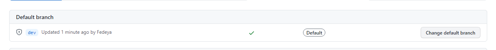
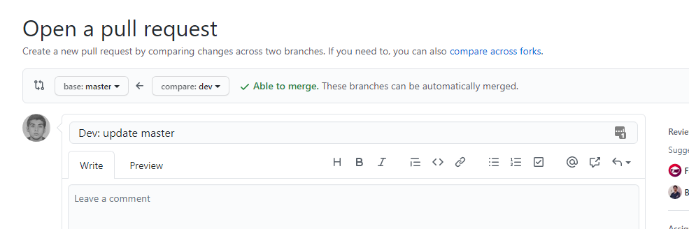
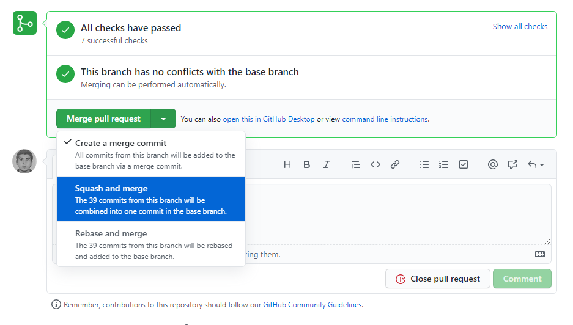
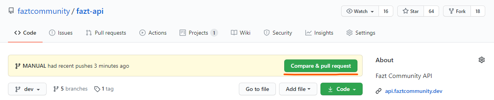
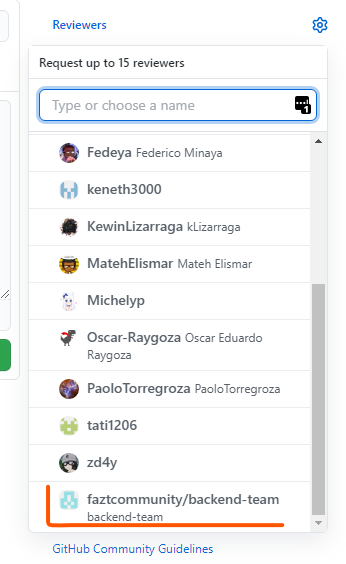

# Manual

## Pasos para actualizar MASTER:

1. Colocar el branch MASTER por default en github.


2. Abrir PR: DEV -> MASTER.


3. Seleccionar SQUASH en github para comprimir todos los commits de DEV a MASTER.


4. Actualizar [version del proyecto](##Actualizar-Version). **(OPCIONAL)**

5. Eliminar branch DEV y crearlo de nuevo sobre el branch MASTER actualizado.

6. Actualizar el branch DEV remoto.

```sh
git push fazt dev -f
```

7. Colocar el branch DEV por default en github.

8. Avisar a todos para que actualicen sus entornos locales con los nuevos branch: DEV y
   MASTER.


```sh
git pull origin dev master
```

---

## Pasos para agregar cambios en la API:

0. Revisar el [github projects](https://github.com/faztcommunity/fazt-api/projects) para ver que tareas hay en **(To do)**, escoger una y pasarla a **(In progress)**.

1. Actualizar y fusionar el branch DEV local con el remoto

```sh
git pull origin dev
```

2. Pararse sobre el branch DEV

```sh
git checkout dev
```

3. Crear nuevo branch y pararse sobre el

```sh
git checkout -b FEATURE_NAME
```

4. Ir agregando cambios a su branch creado

```sh
git add . # para agregar todos los cambios
git add PATH_FILE_1 PATH_FILE_2 ... # para agregar archivos manualmente se debe ingresar la ruta absoluta de cada uno
```

5. Crear commits

```sh
git commit -m "COMMIT_TITLE" # para crear un commit con mensaje de una sola linea
git commit # se abre un editor en la terminal: (nano, vim, etc) para crear un commit con mensaje de varias lineas
```

- Ejemplo de commit con mensaje de varias lineas. **Los doble saltos de linea mostrados son obligatorios**.

```sh
TITLE_1

SUBTITLE_1 # opcional

- feature_1
- feature_2
- ...

TITLE_2

SUBTITLE_2 # opcional

- feature_1
- feature_2
- ...
```

- Para la creacion de los mensajes de los commits guiarse de los siguientes documentos.
1. [faztcommunity/docs](https://github.com/faztcommunity/docs/blob/master/contribute.md#Commits)
2. [conventional-changelog/commitlint](https://github.com/conventional-changelog/commitlint/#what-is-commitlint)


- Si por error se agrega un archivo erroneo al commit, se puede deshacer de esta manera.

```sh
git rm --cache PATH_FILE
git commit --amend --no-edit # se actualiza el ultimo commit sin editar el mensaje
```

6. Subir el branch local a uno remoto.

```sh
git push origin LOCAL_BRANCH_NAME # se sube el branch local a github creando un branch remoto con el mismo nombre del local
```

7. Ir al repo de github y abrir PULL_REQUEST hacia DEV. **Por defecto esta en DEV**


8. Solicitar reviews al **backend-team** en github, (panel derecho llamado: **Reviewers**) para notificar a todos.


9. Esperar que **2 miembros** del team **revisen y aprueben** el PR.

10. Hacer las correcciones que indique el equipo, agregar los commits faltantes y actualizar el PR.

```sh
git add .

# para nuevos commits (cambios faltantes)
git commit
git push origin BRANCH_NAME # se actualiza el PR abierto

# para editar commits (correcciones)
git commit --amend
git push origin BRANCH_NAME -f
```

- Si un PR se fusiona antes en el branch DEV se debe rebasar los nuevos cambios y actualizar el branch
```sh
git rebase dev
# resolver los conflictos (en el editor preferiblemente)
git rebase --continue # para paginar o terminar la revision de los conflictos
git commit --amend --no-edit
git push origin BRANCH_NAME -f
```

11. La ultima persona que revise y apruebe el PR en github debe fusionar los cambios (MERGE ó SQUASH)

---

## Actualizar Version:

- Cada vez que se actualiza el branch MASTER se debe cambiar la version del proyecto en el archivo `package.json`, luego subir este commit a MASTER y crear sobre ese mismo commit un TAG con la version del proyecto. [**USAR VERSIONAMIENTO SEMANTICO**](https://semver.org/)
---

## Notas Generales:

- Para evitar el paso 1 y 7 indicados [al principio de este documento](##Pasos-para-actualizar-MASTER:) se debe configurar el branch MASTER por defecto, **con la desventaja** de que hay que colocar el branch DEV cada ves que se cree un nuevo PR a DEV ya que github lo coloca siempre en MASTER.

- Si el branch DEV esta sobre MASTER (como debe estar siempre), no debería arrojar ningun
  conflicto al abrir el PR

- Recomiendo no actualizar MASTER seguido, mejor crear un branch DEPLOY o RELEASE cuando se
  quiera probar la api en un entorno de pre-produccion.

- Si no quieren borrar/crear el branch DEV, entonces deben seleccionar MERGE en github al
  momento de fusionar el PR: DEV -> MASTER. De esta manera se conservan todos los commits
  creados en DEV.

- **No recomiendo** utilizar MERGE MASTER para no ensuciar el branch de commits inadecuados,
  pues en el branch DEV se introducen muchos commits innecesarios, repetidos y erroneos.

- Existen otras metodologias de trabajo, pero involucran la creacion de mas
  branchs (no temporales) y otras maneras de fusionarlos. Si alguien quiere proponer una, que redacte una explicacion como esta y la presente.
